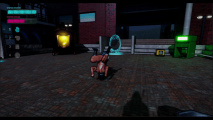
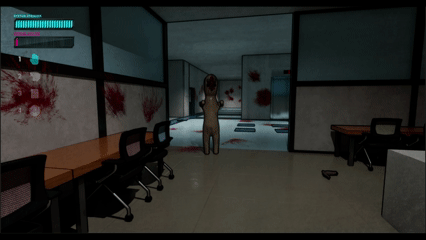
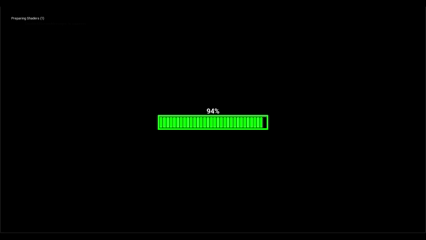

# Containment Cleanup Detail

-orange)

> '비세라 클린업 디테일'의 청소 시뮬레이션과 SCP 세계관을 결합한 3인 협동 공포 게임입니다.
>
> 한국공학대학교 게임공학과 졸업작품(종합설계)으로 개발했습니다.

---

## ■ 핵심 기술 포인트

- **협동 청소 상호작용 시스템** — LineTrace 기반 상호작용 컴포넌트(`CCD_InteractionComponent`)와 대걸레·스캐너·발광스틱·냉동 수류탄 등 도구 액터(`CCD_EquipActor_Base` 파생)로 오염 제거·수색·조명 등 최대 3인 협동 플레이를 구성.
- **Chaos Destruction 기반 파편 연출 (JUICY)** — 시체를 `CCD_BodyFragment`로 파편화해 개별 `SkeletalMeshComponent` 액터로 전환, 래그돌 물리와 소각로 상호작용을 부여.
- **오염도 동적 머티리얼 & 소음 연동** — 대걸레 오염도를 실시간 머티리얼 파라미터로 시각화하고, 청소 행동이 `AISense_Hearing`을 통해 적 AI의 감지에 영향을 주도록 연결.
- **Steam 기반 협동 멀티플레이** — Steam Online Subsystem 세션/로비, 서버 권한형(server-authoritative) 구조 위에서 맵 클리어 기록 복제와 관리자 명령어(치트) 시스템 구현.
- **SCP 적 AI 비헤이비어 트리** — SCP-096·173·939 각각 고유한 추격/패닉/은신 행동 패턴 구현.

---

## ■ 스크린샷 / 데모

<!-- TODO: 실제 스크린샷/GIF로 교체 -->
| **Chaos Destruction** | **협동 플레이** |
|:---:|:---:|
|  |  |
| **SCP** | **엔딩** |
|  |  |

> ▶ **플레이 영상:** https://youtu.be/252ZhIEaado?si=Bwswb_obWmwVbQvG

---

## 프로젝트 개요
- **장르:** SCP 세계관 기반 협동 공포 청소 시뮬레이션
- **주요 메커니즘:** 청소 도구를 이용한 오염 제거, 소음·시야 기반 은신, 시체 파편 처리, 최대 3인 협동 멀티플레이
- **개발 인원:** 3인 팀 (졸업작품/종합설계)

## 개발 기간 & 담당 역할
- **개발 기간:** 2025-12-30 ~ 2026-07-09 (약 6.4개월)
- **팀 구성 및 역할**
  - **조성욱 — 클라이언트, 시스템/아키텍처 프로그래밍 및 연출**
  - **지민우 — 클라이언트, 기획 및 AI 프로그래밍**
  - **김다니엘 — 모델링**

## 기술 스택
- **Unreal Engine 5.7**
- **C++**
- **Steam Online Subsystem**
- **Chaos Destruction / Niagara VFX**

## 현재 진행 상황
- 2026년 7월 졸업작품(종합설계) 최종 발표를 끝으로 개발을 마무리했습니다.
- 코어 청소 루프, 협동 멀티플레이, 엔딩까지 전 구간 플레이 가능한 상태입니다.

## 트러블슈팅 요약

- **스팀 '고스트 세션' 문제** — PIE 디버깅 시 `IOnlineSubsystem::Get()`이 에디터 전역 서브시스템을 반환해 세션 종료 후에도 로컬에 죽은 세션이 남는 문제를, 월드 컨텍스트 기반 `Online::GetSubsystem(GetWorld())`와 잔여 세션 강제 정리 로직으로 해결.
- **로비 UI 동기화 지연** — 관리자 명령어로 맵 클리어 상태를 조작해도 속성 복제 지연으로 다른 클라이언트 UI가 늦게 갱신되던 문제를, Multicast RPC로 선행 반영 및 강제 새로고침하도록 해결.
- **소형 오브젝트 충돌 시 카메라 튕김** — 작은 피직스 프롭과의 충돌로 1인칭 카메라가 튕기던 멀미 유발 버그를 프롭 질량·댐핑 조정과 캐릭터 무브먼트 설정으로 해결.
- **대걸레 오염도 최대치 데칼 소실 오류** — 핏자국 데칼이 자체 표면 검사에 걸려 스폰 즉시 지워지던 문제를 커스텀 트레이스 채널로 해결.

## License
이 저장소는 오픈소스가 아닙니다. 포트폴리오 열람 목적으로만 코드 확인이 가능하며, 팀원 전원의 명시적 서면 허가 없이 복제·수정·배포·상업적/비상업적 사용을 금지합니다.
